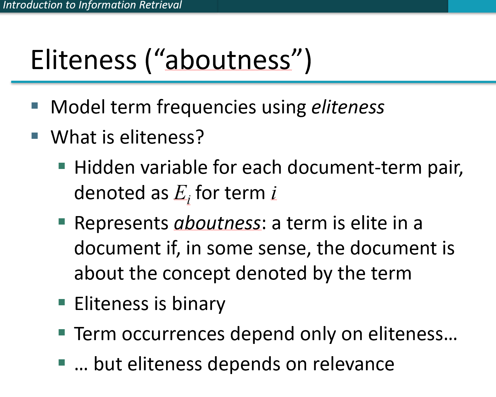
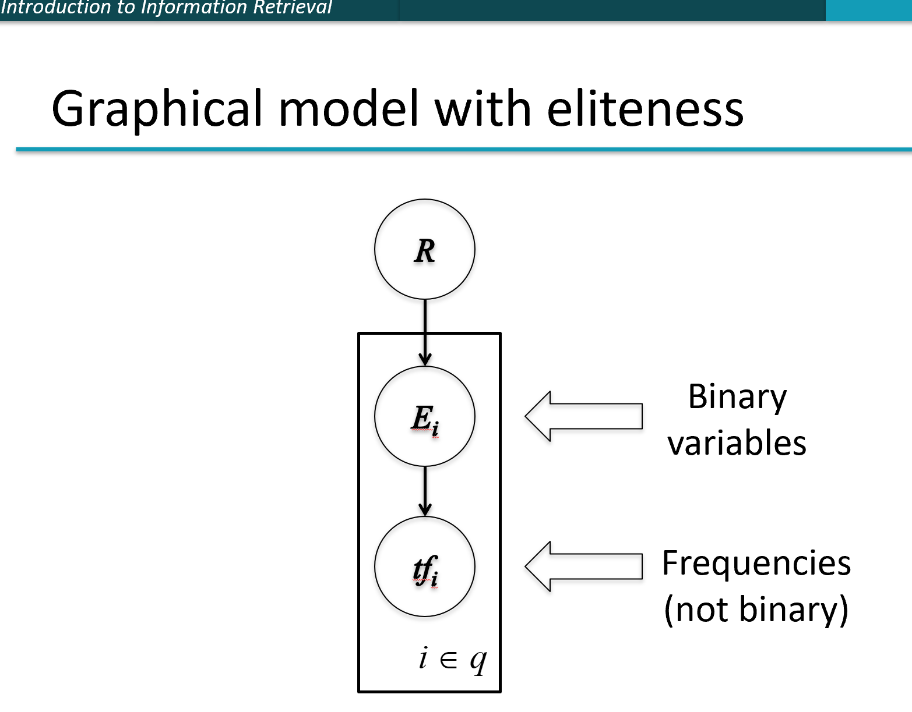
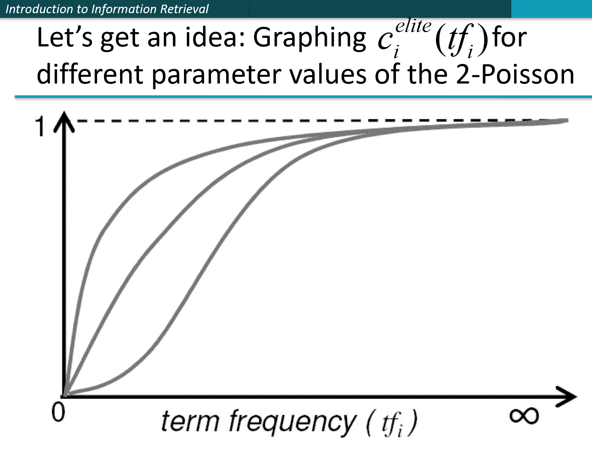
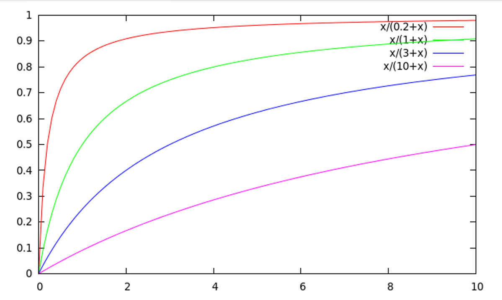

这里总结关于IR 系统中，rank的一些**概率**模型，BIM，BM25

# introduction

IR系统的核心就是ranking，也就是非常直观的任务，对于user的一个query $q$, IR系统希望给每个检索出来的文档一个分数 score，按照score由高到低反馈给用户，而概率模型的核心就是对这个分数，用概率建模。

> $P(R|q,d)$ 其中 $R$ 是一个binary事件变量，$R=1$ 表示相关，$R=0$ 表示不相关。$q$ 表示user的查询，而 $d$ 表示文档

由于我们只care的是rank(相对大小)而不是 $Prob$ 绝对大小。因此在概率模型中我们使用的metric通常是

> $Odd(R|q,d)=\frac{P(R=1|q,d)}{P(R=0|q,d)}$

下面介绍两种概率模型，BIM，BM25，分别基于 二项分布和泊松分布

# BIM( binary independent model)

首先将document 向量化成 $x = (x_1,\dots ,x_i,\dots ,x_T ),T$ 表示 query 中 $term$ 的数量，$x_i =1 \iff term_i$ 在document $d$ 中

那么 score

$$
\begin{aligned}
O(R|q,d) &= O(Q|q,x)\\
&= \frac{\Pr(R=1|q,x)}{\Pr(R=0|q,x)}\\
&= \frac{\frac{\Pr(R=1|q)\Pr(x|R=1,q)}{\Pr(x|q)}}{\frac{\Pr(R=0|q)\Pr(x|R=0,q)}{\Pr(x|q)}} (bayes\ rule)\\
&=O(R|q)\frac{\Pr(x|R=1,q)}{\Pr(x|R=0,q)}
\end{aligned}
$$

因为 $q$ 对于每个document $d$ 来说，都是一样的，可以看做一个常量，因此我们重点关心的是 
$$\frac{\Pr(x|R=1,q)}{\Pr(x|R=0,q)} \tag{1}$$

binary independent model 的核心就是两个假设:

1. 每个 $term_i$ 是一个二项分布
2. $term_i$ 独立

基于独立性假设对于等式 $(1)$, 我们有

$$
\begin{aligned}
score(q,d) &=\prod_{i=1}^T \frac{\Pr(x_i|R=1,q)}{\Pr(x_i|R=0,q)}\\
&=\prod_{x_i=1}\frac{\Pr(x_i=1|R=1,q)}{\Pr(x_i=1|R=0,q)}\prod_{x_i=0}\frac{\Pr(x_i=0|R=1,q)}{\Pr(x_i=0|R=0,q)}\\

\mathbf{let}\ p_i&=\Pr(x_i=1|R=1,q),r_i=\Pr(x_i=0|R=0,q)\\
&=\prod_{x_i=1}\frac{p_i}{r_i}\prod_{x_i=0}\frac{1 - p_i}{1-r_i}\\
&=\prod_{x_i=1}\frac{p_i}{r_i}(\prod_{x_i=1}\frac{1-r_i}{1-p_i} \frac{1-p_i}{1-r_i})\prod_{x_i=0}\frac{1 - p_i}{1-r_i}\\
&=\prod_{x_i=1} \frac{p_i(1-r_i)}{r_i(1-p_i)}(\prod_{i=0}^T \frac{1-p_i}{1-r_i} ->constant)
\end{aligned}
$$

因此，最终我们需要计算的就是

$$
score(q,x)=\prod_{x_i=1} \frac{p_i(1-r_i)}{r_i(1-p_i)}\tag{2} 
$$

## Retrieval Status Value

将 $(2)$ 式取对数，我们得到,

$$
\begin{aligned}
RSV &= \sum \log \frac{p_i(1-r_i)}{r_i(1-p_i)}\tag{3}\\
\end{aligned}
$$

**define**

$$
c_i= \log \frac{p_i(1-r_i)}{r_i(1-p_i)}\tag{4}
$$

接下来的任务便是估计 $c_i$ 了

## estimate $c_i$

假设对于整个集合中的文档，我们能够得到如下的统计表格

|doc|Relevant|Non-Relevant|Total|
|:---:|:---:|:---:|:---:|
|$x_i=1$| $s$ |$n-s$|$n$|
|$x_i=0$|$S-s$ |$N-n-S+s$|$N-n$|
|**sum**|$S$|$N-S$|$N$|

(**note** 小 $s$ 通常很难估计)

$$
p_i=\frac{s}{S},r_i=\frac{n-s}{N-S},1-r_i=\frac{N-S+s-n}{N-S},1-p_i=\frac{S-s}{S}
$$

假设 $N-S \approx N$

$$
\begin{aligned}
\log \frac{1-r_i}{r_i}&=\log \frac{N-n-S+s}{n-s}\\
&\approx\log \frac{N-n}{n}\\
&\approx \log \frac{N}{n}=IDF!
\end{aligned}
$$

**最难估计的是 $p_i$ 一种可以的方法是不停的在系统中迭代，来估计$s$,不过这对系统和数据的需求都很大，而且急需真实的系统场景和环境**

这个模型还有一个问题，他没有将term frequency 纳入其中，也就是说，通常来说，一篇document 如果其中的term frequency 出现的次数很多，通常它的相关性会高一些，BIM并未对此建模

# BM25(Best Match 25)

我们来看看下面一个基于(possion distribution )泊松分布的 模型

BM25对term frequency建模，同时它提出了一个 **eliteness** 的概念

>所谓 **eliteness** 也就是说在query中的某些 term，他是是特别的(整篇文档都是关于这些term的，这完全有道理，比如paper 的key words)

(**注** 未特别说明本文所有图片均引用自 ref1)

其实可以将 eliteness 看做一个 “隐”变量(hiden variable)

>同时它表示 $\Pr(TF_i=i)$ 为possion 泊松分布

基于以上假设，我们可以建立如下模型

$$
RSV^{elite}=\sum_{tf_i>0}c_{i}^{elite}(tf_i)
$$

whre,
$$
c_{i}^{elite}(tf_i) = \log \frac{\Pr(TF_i=tf_i|R=1)\Pr(TF_i=0|R=0)}{\Pr(TF_i=tf_i|R=0)\Pr(TF_i=0|R=1)}
$$

and,

$$
\Pr(TF_i=tf_i|R)=\Pr(E_i=Elite|R)\Pr(TF_i= tf_i | E_i=Elite) + \Pr(E_i=\bar{Elite})\Pr(TF_i= tf_i | E_i=\bar{Elite})
$$

这就对term项建立了双泊松模型:

$$
\Pr(TF_i=k|R)=\pi \frac{\lambda^k}{k!}e^{-\lambda} + (1 - \lambda)\frac{\mu^k}{k!}e^{-\mu}
$$

parameter $\pi,\mu,\lambda$ 都非常难以估计，因此，这里又采用了近似!(PS:我发现近似真实个非常神奇的东西)

## approximation

观察这个函数有几个性质:

1. $c_i(0)=0$
2. $c_i(tf_i)$ 随着 $tf_i$ 单调递增
3. $c_i(tf_i)$ 有一个渐进线

## saturation function

sf : $\frac{tf}{k+tf}$

## BM25

$$c_i^{BM25v2}=\log \frac{N}{df_i}\frac{(k_1+1)tf_i}{k_1+tf_i}\tag{5}$$

以上公式与 tf-idf非常像，不过 tf项是有界的(saturation function))，分子系数意义不大，仅仅是让 tf=1时这个值为1，估计是想让这项的值变化不那么陡峭吧

### document length normalization

基于两个intuition

1. 长文本通常更加可能观察到term
2. 长文本观察到的term frequency 通常更高

$dl=\sum_{tf\in d} tf_i$

$avdl$： 整个文本集合中的平均文本长度

$B=((1-b) + b\frac{dl}{avdl}), b\in[0,1]$

$b$ 正则因子

let $tf_i'=\frac{tf_i}{B}$, 带入 equation $(5)$ 我们得到真正的

$$
\begin{aligned}
c_i^{BM25}(tf_i)&=c_i^{BM25v2}(tf_i')\\
&=\log \frac{N}{df_i}\frac{(k_1+1)tf_i}{k1((1-b)+b\frac{dl}{avdl}) + tf_i} \tag{6}   
\end{aligned}
$$

and,

$$
RSV^{BM25}=\sum c_i^{BM25}(tf_i)\tag{7}
$$

# other feature

- 文本特征
  - Zones(区域) : Title,author,abstract,body,anchors。。
  - Proximity(近邻): 分类文本，邻近文本查找
  - ...
- 非文本特征
  - File type
  - File age
  - Page Rank
  - ...

(PS: 这些特征都需要从真实的系统,业务场景中去查找，所以写在这里再多，仅仅纸上谈兵肯定是不行的，所以这里仅仅是对知识做个总结，表明有这个东西)

# resource

1. S. E. Robertson and K. Spärck Jones. 1976. Relevance Weighting of Search Terms. Journal of the American Society for Information Sciences 27(3): 129–146.
2. C. J. van Rijsbergen. 1979. Information Retrieval. 2nd ed. London: Butterworths, chapter 6. http://www.dcs.gla.ac.uk/Keith/Preface.html
3. K. Spärck Jones, S. Walker, and S. E. Robertson. 2000. A probabilistic model of information retrieval: Development and comparative experiments. Part 1. Information Processing and Management 779–808.
4. S. E. Robertson and H. Zaragoza. 2009. The Probabilistic Relevance Framework: BM25 and Beyond. Foundations and Trends in Information Retrieval 3(4): 333-389.

# ref

1. slides in https://web.stanford.edu/class/cs276/ (Probabilistic IR: the binary independence model, BM25, BM25F | Evaluation methods & NDCG|Learning to rank)